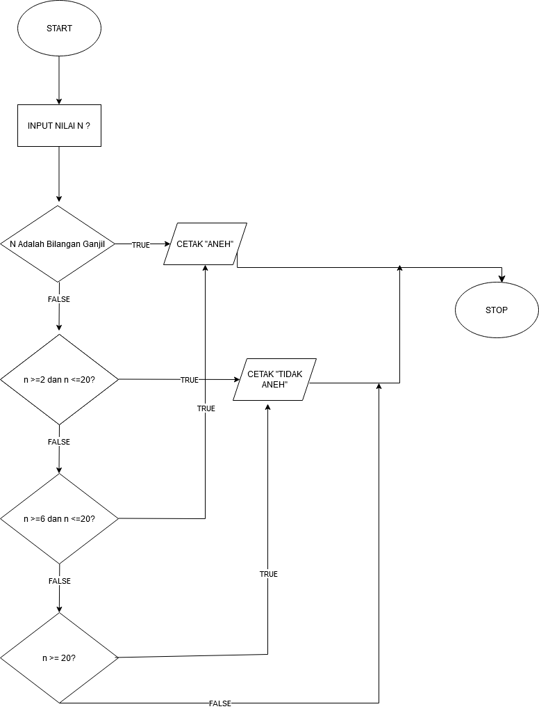
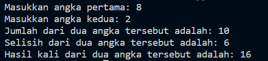
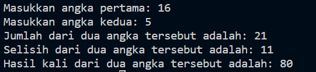
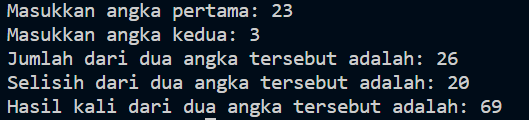
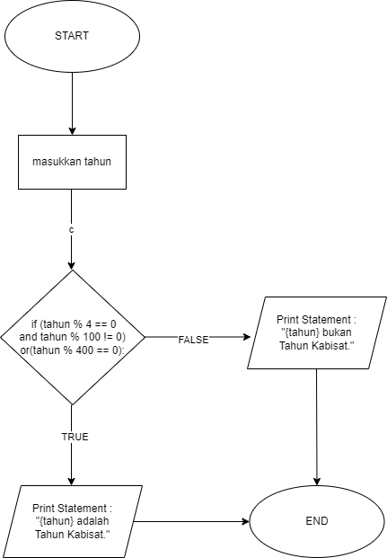

# Assignment 01

Group members
- Damasus Hardiven Waruwu (16231014) (Problem 1)
- Revalina Putria Hidayat (16231049) (Problem 2)
- Muhammad Muhfi Zerham (20231045) (Problem 3)
- Riska Fadlun Khairiyah P (10231083) (Problem 4)
- Ansellma Tita Pakartiwuri Putri  (10231017) (Problem 5)
- Muhammad Kevin Wardhana (11231057) (Problem 5)

## Problem 1

Diberikan sebuah keluaran dari suatu program sebagai berikut:

```
 =====    =====    =   =
   =        =      =  =
   =        =      = = 
   =        =      =  =
 =====      =      =   =
```

Menggunakan perintah `print()` dalam Python, tuliskan program
Python untuk mencetak tulisan ITK di atas.

### Answer

``` print("=====    =====    =   =")
print("  =        =      =  =")
print("  =        =      = = ")
print("  =        =      =  =")
print("=====      =      =   =")``` 

## Problem 2
Diberikan suatu bilangan bulat `n`, buatlah _flowchart_ untuk perintah berikut
- Jika `n` adalah bilangan ganjil, cetak `Aneh`
- Jika `n` adalah bilanga bulat yang berada di rengang dari 2 sampai 5,
  cetak `Tidak Aneh`
- Jika `n` adalah bilangan bulat yang berada di rentang dari 6 sampai 20,
  cetak `Aneh`
- Jika `n` adalah bilangan bulat dan lebh besar dari 20, cetak `Tidak Aneh`.

### Answer

``` n = int(input("Masukkan sebuah bilangan: "))
if n % 2 == 1:
    print("Aneh")
elif 2 <= n <= 5:
    print("Tidak Aneh")
elif 6 <= n <= 20:
    print("Aneh")
elif n > 20:
    print("Tidak Aneh")
else:
    print("Input Tidak Valid")``` 



## Problem 3
Lengkapi potongan kode Python berikut supaya ketika _user_ memberikan 
dua masukan angka, sebut sebagai variabel `a` dan `b` maka akan 
tercetak 3 baris tambahan sebagai berikut
1. Baris pertama merupakan jumlahan dari dua angka tersebut
2. Baris kedua merupakan selisih dua angka tersebut (angka masukan pertama 
   dikurangi angka masukan kedua)
3. Baris ketiga merupakan hasil kali dari angka tersebut.

```py
a = int(input("Masukkan angka pertama"))
b = int(input("Masukkan angka kedua"))
### Tulis kode sesuai 3 perintah di atas 
```

Tampilkan juga tiga contoh _test cases_ masukan `a` dan `b`

### Answer

``` a = int(input("Masukkan angka pertama: "))
b = int(input("Masukkan angka kedua: "))

# Jumlah dari dua angka
jumlah = a + b

# Selisih dua angka
selisih = a - b

# Hasil kali dari dua angka
kali = a * b

# Mencetak hasil
print(f"Jumlah dari dua angka tersebut adalah: {jumlah}")
print(f"Selisih dari dua angka tersebut adalah: {selisih}")
print(f"Hasil kali dari dua angka tersebut adalah: {kali}")``` 







## Problem 4
Bakteri _Bacillus cereus_ membelah diri rata-rata setiap 20 menit sekali.
Jika di awal suatu cawan petri terdapat 100 bakteri _Bacilus cerues_, 
ada berapa bakteri setelah satu hari?

Jawablah pertanyaan tersebut dengan membuat program Python.
Gunakan variabel `jumlah_bakteri` dan variabel `waktu`.

### Answer

``` # Jumlah bakteri awal 
jumlah_bakteri = 100

# Waktu dalam menit
waktu = 24 * 60  # Satu hari memiliki 24 jam, setiap jam memiliki 60 menit

# Menghitung berapa kali bakteri membelah dalam satu hari
jumlah_pembelahan = waktu / 20

# Menghitung jumlah bakteri setelah satu hari
jumlah_bakteri_setelah_satu_hari = jumlah_bakteri * (2 ** jumlah_pembelahan)

print(f"Jumlah bakteri setelah satu hari: {jumlah_bakteri_setelah_satu_hari}")``` 

## Problem 5
Masih mengacu pada Problem (4). Jika bakteri _Bacillus cereus_ 
meninggal setelah hidup satu hari. Ada berapa bakteri 
yang masih hidup setelah 500 jam?

Jawablah pertanyaan tersebut dengan membuat program Python.
Gunakan variabel `jumlah_bakteri_hidup`, variabel `jumlah_bakteri_meninggal` dan variabel `waktu`.

### Answer

``` print(" *Program Tahun Kabisat* ")

def tahun_kabisat(tahun):
    if (tahun % 4 == 0 and tahun % 100 != 0) or (tahun % 400 == 0):
        return True
    else:
        return False

tahun = int(input("Masukkan tahun: "))

if tahun_kabisat(tahun):
    print(f"{tahun} adalah Tahun Kabisat.")
else:
    print(f"{tahun} bukan Tahun Kabisat.")``` 

## Problem 6
Satu hari akan ditambahkan pada kalender hampir tiap empat tahun sekali
yaitu pada tanggal 29 Februari, hari tersebut disebut _hari kabisat_.
Hari kabisat tersebut ditambahkan dengan tujuan karena dalam satu tahun
planet bumi mengelilingi matahari tidak tepat bilangan bulat, namun
365.25 hari. Suatu tahun yang memuat hari kabisat disebut _tahun kabisat_.

Di dalam kalender Masehi (kalender yang umum digunakan di seluruh dunia),
ada tiga kondisi untuk mengidentifikasikan suatu tahun adalah tahun kabisat

- Jika suatu tahun habis dibagi 4 maka tahun tersebut
  adalah tahun kabisat jika TIDAK habis dibagi 100.
  - Jika habis dibagi 100 maka tahun tersebut adalah tahun kabisat 
    jika habis juga dibagi 400.
    - Jika tidak habis dibagi 400, maka tersebut BUKAN tahun kabisat.


Buatlah _flowchart_ dari program penentuan suatu tahun 
apakah tahun kabisat atau bukan.
Ujilah program dengan tahun-tahun berikut: 2024, 2023, 2000, 1900.

### Answer

``` bakteri = 100
waktu = 20
satu_hari = 72
# untuk 500 jam (500 * 60 menit)
r = 30000 / waktu #jumlah pembelahan yang terjadi dalam 500 jam
n = 1
kematian = 0
y = 0

while n <= r:
    if n >= satu_hari:
        y = n - satu_hari
        kematian = bakteri * 2**y
        
    jumlah_pembelahan = bakteri * 2**n
    jumlah_bakteri = jumlah_pembelahan - kematian
    
    print(f"Pembelahan ke {n} = ", "{:,}".format(jumlah_pembelahan))
    if n >= satu_hari:
        print(f"Kematian ke {y+1} = ", "{:,}".format(kematian))
        print(f"Total Bakteri = ", "{:,}".format(jumlah_bakteri))
        print("--")
    n = n + 1``` 

    
