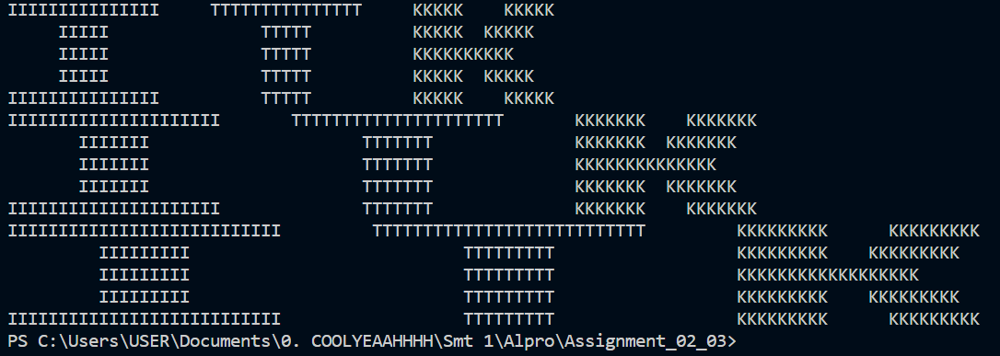

# Assignment 02

Group members
- Muhammad Kevin Wardhana (11231057) (Problem 2)
- Revalina Putria Hidayat (16231049) (Problem 3)
- Riska Fadlun Kahiriyah P (10231083) (Problem 4)
- Damasus Hardiven Waruwu (16231014) (Problem 5)
- Ansellma Tita Pakartiwuri Putri (10231017) (Problem 1 & 6)


## Problem 1: Automated symbol printing 1
Menggunakan _method_ pada _String_: `.rjust()`, `.ljust()` dan `.center()`,
susunlah logo ITK berikut.

```
IIIIIIIII   TTTTTTTTT   KKK   KKK
   III         TTT      KKK KKK
   III         TTT      KKKKKK
   III         TTT      KKK KKK
IIIIIIIII      TTT      KKK   KKK
```
Logo di atas memliki lebar `n = 3`. Perhatikan untuk `n = 3`
lebar huruf `3n` dan tinggi huruf `2n - 1` dan jarak antar antar
huruf adalah `n`.

Uji untuk ukuran logo `n = 5`, `n = 7`, dan `n = 9`

### Answer
Code:
```
n = 5  # Lebar logo

# Membuat baris pertama
row1 = "I" * (3 * 5) + " " * 5 + "T" * (3 * 5) + " " * 5 + "K" * 5 + " " * (5 - 1) + "K" * 5
print(row1)

# Membuat baris kedua
row2 = (" " * 5 + "I" * 5 + " " * (16 - 1) + "T" * 5 + " " * 10 + "K" * 5 + " " * (3 - 1) + "K" * 5)
print(row2)

# Membuat baris ketiga
row3 = " " * 5 + "I" * 5 + " " * (16 - 1) + "T" * 5 + " " * 10 + "K" * (5 * 2)
print(row3)

# Membuat baris keempat
row4 = " " * 5 + "I" * 5 + " " * (16 - 1) + "T" * 5 + " " * 10 + "K" * 5 + " " * (3 - 1) + "K" * 5
print(row4)

# Membuat baris kelima
row5 = "I" * (3 * n) + " " * (11 - 1) + "T" * 5 + " " * 10 + "K" * 5 + " " * (5 - 1) + "K" * 5
print(row5)


n = 7  # Lebar logo

# Membuat baris pertama
row1 = "I" * (3 * 7) + " " * 7 + "T" * (3 * 7) + " " * 7 + "K" * 7 + " " * (5 - 1) + "K" * 7
print(row1)

# Membuat baris kedua
row2 = (" " * 7 + "I" * 7 + " " * (22 - 1) + "T" * 7 + " " * 14 + "K" * 7 + " " * (3 - 1) + "K" * 7)
print(row2)

# Membuat baris ketiga
row3 = " " * 7 + "I" * 7 + " " * (22 - 1) + "T" * 7 + " " * 14 + "K" * (7 * 2)
print(row3)

# Membuat baris keempat
row4 = " " * 7 + "I" * 7 + " " * (22 - 1) + "T" * 7 + " " * 14 + "K" * 7 + " " * (3 - 1) + "K" * 7
print(row4)

# Membuat baris kelima
row5 = "I" * (3 * n) + " " * (15 - 1) + "T" * n + " " * 14 + "K" * 7 + " " * (5 - 1) + "K" * 7
print(row5)


n = 9  # Lebar logo

# Membuat baris pertama
row1 = "I" * (3 * 9) + " " * 9 + "T" * (3 * 9) + " " * 9 + "K" * 9 + " " * (7 - 1) + "K" * 9
print(row1)

# Membuat baris kedua
row2 = (" " * 9 + "I" * 9 + " " * (28 - 1) + "T" * 9 + " " * 18 + "K" * 9 + " " * (5 - 1) + "K" * 9)
print(row2)

# Membuat baris ketiga
row3 = " " * 9 + "I" * 9 + " " * (28 - 1) + "T" * 9 + " " * 18 + "K" * (9 * 2)
print(row3)

# Membuat baris keempat
row4 = " " * 9 + "I" * 9 + " " * (28 - 1) + "T" * 9 + " " * 18 + "K" * 9 + " " * (5 - 1) + "K" * 9
print(row4)

# Membuat baris kelima
row5 = "I" * (3 * n) + " " * (19 - 1) + "T" * 9 + " " * 18 + "K" * 9 + " " * (7 - 1) + "K" * 9
print(row5)
```
Output:



## Problem 2: Automated symbol printing 2
Melanjutkan Problem 1. Tambahkan fitur berikut:
1. Masukan oleh _user_ logo yang ingin dicetak
   `logo_name: `
2. Masukan oleh _user_ ukuran logo `n: `

Contoh program
```
logo_name: KMITK
        n: 3

Hasil cetak logo

KKK   KKK   MMM         MMM   IIIIIIIII   TTTTTTTTT   KKK   KKK
KKK KKK     MMMM       MMMM      III         TTT      KKK KKK
KKKKKK      MMMMMM   MMMMMM      III         TTT      KKKKKK
KKK KKK     MMM   MMM   MMM      III         TTT      KKK KKK
KKK   KKK   MMM         MMM   IIIIIIIII      TTT      KKK   KKK
```
Lihat acuan semua karakter _alphanumeric_ di tautan berikut
[alphanumeric specs](./letter_spesification.md)

[Opsional (boleh dikerjakan atau tidak)] Untuk `n = 5`, `n = 7`, dan `n = 9`, silahkan 
dibuat terlebih dahulu spesifikasinya.

### Answer
```
# Dictionary untuk karakter alphanumeric
alphanumeric_specs = {
    'A': ["    A    ", "   AAA   ", "  AAAAA  ", " AAA AAA ", "AAA   AAA"],
    'B': ["BBBBBBBB ", "BBB   BBB", "BBBBBBBB ", "BBB   BBB", "BBBBBBBB "],
    'C': ["  CCCCCCC", " CCC     ", "CCC      ", " CCC     ", "  CCCCCCC"],
    'D': ["DDDDDD   ", "DDD  DDD ", "DDD   DDD", "DDD  DDD ", "DDDDDD   "],
    'E': ["EEEEEEEEE", "EEE      ", "EEEEEE   ", "EEE      ", "EEEEEEEEE"],
    'F': ["FFFFFFFFF", "FFF      ", "FFFFFF   ", "FFF      ", "FFF      "],
    'G': [" GGGGGGG ", "GGG      ", "GGG  GGGG", "GGG   GGG", " GGGGGGG "],
    'H': ["HHH   HHH", "HHH   HHH", "HHHHHHHHH", "HHH   HHH", "HHH   HHH"],
    'I': ["IIIIIIIII", "   III   ", "   III   ", "   III   ", "IIIIIIIII"],
    'J': ["JJJJJJJJJ", "      JJJ", "      JJJ", "JJJ   JJJ", " JJJJJJJ "],
    'K': ["KKK   KKK", "KKK  KKK ", "KKKKKK   ", "KKK  KKK ", "KKK   KKK"],
    'L': ["LLL      ", "LLL      ", "LLL      ", "LLL      ", "LLLLLLLLL"],
    'M': ["MMM         MMM", "MMMM       MMMM", "MMMMMM   MMMMMM", "MMM   MMM   MMM", "MMM         MMM"],
    'N': ["NNN   NNN", "NNNN  NNN", "NNNNNNNNN", "NNN  NNNN", "NNN   NNN"],
    'O': ["  OOOOO  ", " OOO OOO ", "OOO   OOO", " OOO OOO ", "  OOOOO  "],
    'P': ["PPPPPPPP ", "PPP   PPP", "PPPPPPPP ", "PPP      ", "PPP      "],
    'Q': ["  QQQQQ  ", " QQQ QQQ ", "QQQ   QQQ", " QQQ QQQ ", "  QQQQ QQ"],
    'R': ["RRRRRRRR ", "RRR   RRR", "RRRRRRRR ", "RRR  RRR ", "RRR   RRR"],
    'S': ["  SSSSSS ", "SSS      ", " SSSSSSS ", "      SSS", " SSSSSS  "],
    'T': ["TTTTTTTTT", "   TTT   ", "   TTT   ", "   TTT   ", "   TTT   "],
    'U': ["UUU   UUU", "UUU   UUU", "UUU   UUU", "UUU   UUU", "  UUUUU  "],
    'V': ["VVV   VVV", " VVV VVV ", "  VVVVV  ", "   VVV   ", "    V    "],
    'W': ["WWW   WWW   WWW", " WWW WWWWW WWW ", "  WWWWW WWWWW  ", "   WWW   WWW   ", "    W     W    "],
    'X': ["XXX   XXX", " XXX XXX ", "  XXXXX  ", " XXX XXX ", "XXX   XXX"],
    'Y': ["YYY   YYY", " YYY YYY ", "  YYYYY  ", "   YYY   ", "   YYY   "],
    'Z': ["ZZZZZZZZZ", "    ZZZ  ", "   ZZZ   ", "  ZZZ    ", "ZZZZZZZZZ"],
    '0': [" 0000000 ", "000   000", "000   000", "000   000", " 0000000 "],
    '1': ["   111   ", "  1111   ", "   111   ", "   111   ", "111111111"],
    '2': [" 222222  ", "22  222  ", "   222   ", "  222    ", "222222222"],
    '3': ["33333333 ", "      333", "   33333 ", "      333", "33333333 "],
    '4': ["      444", "    44444", "  444 444", "444444444", "      444"],
    '5': ["555555555", "555      ", "55555555 ", "     5555", "55555555 "],
    '6': [" 66666   ", "666      ", "666666666", "666   666", " 6666666 "],
    '7': ["777777777", "     777 ", "    777  ", "   777   ", "  777    "],
    '8': [" 8888888 ", "888   888", " 8888888 ", "888   888", " 8888888 "],
    '9': [" 9999999 ", "999   999", " 99999999", "      999", " 9999999 "],
    ' ': ["         ", "         ", "         ", "         ", "         "]
}

# Get the logo name and size from the user
logo_name = input("logo_name: ").upper()
n = int(input("n: "))


# Initialize an empty list to store the lines of the arranged logo
arranged_rows = []

for char in logo_name:
    if char in alphanumeric_specs:
        letter = alphanumeric_specs[char]
        for i in range(len(letter)):
            line = letter[i].rjust(3 * n)
            if i >= len(arranged_rows):
                arranged_rows.append(line)
            else:
                # Add three spaces between letters
                arranged_rows[i] += "   " + line

# Print the arranged logo row by row
for row in arranged_rows:
    print(row)
```

## Problem 3
Buatlah suatu program _String Validator_ untuk _password_ 
menggunakan _methods_ berikut:
`isalpha()`, `isalnum()`, `isdigit()`, `islower()`, `isupper()`
dengan spesifikasi sebagai berikut:
- Jumlah karakter minimum 8 maksimum 16
- Hanya terdiri dari bilangan, abjad, dan _special characters_: `_`, `+`, `?`
- Minimum karakter bilangan 1, minimum karakter abjad 1, minimum
  _special characters_ 1

[Opsional (boleh dikerjakan atau tidak)]: Susunlah kode program Python hanya dalam satu baris kode

### Answer

```
import string

def is_valid_password(password):
    if 8 <= len(password) <= 16:
        if all(char in string.ascii_letters + string.digits + '_+?' for char in password):
            has_digit = any(char.isdigit() for char in password)
            has_alpha = any(char.isalpha() for char in password)
            has_special = any(char in '_+?' for char in password)

            if has_digit and has_alpha and has_special:
                return True

    return False

password = input("Masukkan password: ")

if is_valid_password(password):
    print("Password valid!")
else:
    print("Password tidak valid. Pastikan memenuhi semua kriteria.")
```

## Problem 4
Diberikan data _string_ di Python sebagai berikut:
```py
inventory = "apple emerald brick bone brick coal emerald bone apple brick brick coal bone emerald bone bone apple apple coal bone bone apple brick brick coal brick brick apple brick coal bone brick bone coal apple apple brick apple bone apple brick apple bone apple emerald coal emerald apple brick brick coal brick apple apple bone apple emerald bone bone brick bone bone apple emerald emerald bone brick emerald brick emerald apple bone coal coal coal bone brick bone bone emerald bone emerald coal coal emerald brick brick emerald emerald bone apple brick bone brick emerald brick apple bone apple brick"
```

Hitunglah frekuensi tiap kata dan simpanlah dalam bentuk _dict_ di Python
di variabel `inventory_dict`.

Contoh output program ketika mencetak `inventory_dict`:
```
  apple = 21
emerald = 16
  brick = 25
   bone = 25
   coal = 13
```

### Answer
```
inventory = "apple emerald brick bone brick coal emerald bone apple brick brick coal bone emerald bone bone apple bone apple coal bone bone apple brick brick coal brick brick apple brick coal bone brick bone coal apple apple brick apple bone apple brick apple bone apple emerald coal emerald apple brick brick coal brick apple apple bone apple emerald bone bone brick bone bone apple emerald emerald bone brick emerald brick emerald apple bone coal coal coal bone brick bone bone emerald bone emerald coal coal emerald brick brick emerald emerald bone apple brick bone brick emerald brick apple bone apple brick"
words = inventory.split()
inventory_dict = {}
for word in words:
    if word in inventory_dict:
        inventory_dict[word] += 1
    else:
        inventory_dict[word] = 1
for word, count in inventory_dict.items():
    print(f"{word.ljust(10)} = {count}")
```

## Problem 5: CLI histogram 1
Diberikan suatu data _inventory_ beberapa _materials_ di dalam _video game_
_Mineraft_ sebagai berikut, 
yang dinyatakan dalam bentk _dict_ Python
```py
inventory = {
  "Emerald": 2,
  "Diamond": 30,
  "Redstone": 11,
  "Brick": 28,
  "Coal": 17,
  "Snowball": 0
  "Leather": 10,
  "Paper": 9,
  "Flint": 4,
}
```

Buatlah program Python yang dapat mengubah data _dict_ tersebut ke dalam 
bentuk histogram sebagai berikut:
```
Tabel inventory:
 Emerald: **
 Diamond: ******************************
Redstone: ***********
   Brick: ****************************
    Coal: *****************
Snowball:
 Leather: **********
   Paper: *********
   Flint: ****
```

Jumlha tanda bintang `*` menyatakan banyaknya _materials_. Misal
`"Flint": 4` maka akan tercetak empat kali tanda bintang `****`.
Perhatikan juga nama _materials_ memiliki kesejajaran (_alignment_)
rata-rata kanan dan ada satu spasi setelah `:`.

### Answer

```
inventory = {
  "Emerald": 2,
  "Diamond": 30,
  "Redstone": 11,
  "Brick": 28,
  "Coal": 17,
  "Snowball": 0,
  "Leather": 10,
  "Paper": 9,
  "Flint": 4
}

max_length = max(len(material) for material in inventory.keys())

print("Tabel inventory:")
for material, count in inventory.items():
    stars = "*" * count

    print(f"{material:{max_length}s}: {stars}")
```

## Problem 6: CLI histogram 2
Melanjutkan Problem 5, tambahkan beberapa fitur berikut:
1. Masukan oleh _user_ `lebar_max` dengan type data `int` 
   untuk membatasi lebar histogram.   
 
   $`lebar_max` ini menyatakan berapa banyak tanda bintang `*`
   yang harus dicetak untuk _materials_ dengan jumlah terbanyak.   

   Misalkan _material_ terbanyak `"Diamond": 30` untuk `lebar_max = 50` 
   maka jumlah tanda bintang yang harus tercetak adalah 50 buah. 
   Sedangkan untuk _materials_ yang lain mengikut aturan normalisasi ini. 
   Contoh untuk `"Flint": 4`, maka tanda bintang yang tercetak sebanyak
   `(4/jumlah_material_terbanyak) * lebar_max = (4/30) * 50 = 6.7 = 7`
   (dibulatkan ke bilangan bulat terdekat). 
   
   Pembulatan dapat menggunakan 
   perintah `round()`.

2. Masukan oleh _user_ `is_sorted?` dengan jawaban `y` atau `n`
   untuk mengurutkan secara alfabet nama _materials_.
3. Tambahan angka penunjuk setelah nama _materials_ yang menyatakan
   banyaknya _materials_ tersebut dalam format digit yang sama.
   Misal nilai tertinggi 2 digit, yaitu 30, maka untuk digit-digit yang
   hanya terdiri dari satu digit perlu dilakukan _zero padding_ seperti
   yang ditampilkan contoh di bawah.

Contoh output program:
```
lebar_max: 30 
is_sorted? y

=================
 Tabel inventory 
=================
   Brick [28]: ****************************
    Coal [17]: *****************
 Diamond [30]: ******************************
 Emerald [02]: **
   Flint [04]: ****
 Leather [10]: **********
   Paper [09]: *********
Redstone [11]: ***********
Snowball [00]:
```

Lakukan pengujian untuk `lebar_max = 80` dan data _inventory_ berikut:

```py
inventory = {
  "Lead": 15,
  "Bread": 79,
  "Apple": 22,
  "Bone": 75,
  "Hoe": 1,
  "Pickaxe", 60,
  "Egg": 13,
  "Milk": 17,
  "Slimeball", 94,
  "Salmon": 29,
  "Potato": 45,
  "Gunpowder": 3,
  "Feather": 85,
  "Shears": 95,
  "Wheat": 70,
  "Bucket": 98,
  "Carrot": 26,
  "Crossbow": 23,
  "Arrow": 33,
  "Clay": 23
}
```


### Answer
Code:
```
def create_histogram(inventory, lebar_max, is_sorted=False):
    sorted_inventory = dict(sorted(inventory.items())) if is_sorted else inventory
    max_quantity = max(sorted_inventory.values())
    histogram = {}
    for item, quantity in sorted_inventory.items():
        normalized_quantity = round((quantity / max_quantity) * lebar_max)
        histogram[item] = '*' * normalized_quantity
    return histogram

def print_histogram(histogram):
    max_item_length = max(len(item) for item in histogram.keys())
    print("=" * (max_item_length + 9))
    print(f" Tabel inventory ")
    print("=" * (max_item_length + 9))
    for item, bars in histogram.items():
        print(f"{item} [{bars.count('*'):02d}]: {bars}")

lebar_max = int(input("lebar_max: "))
is_sorted = input("is_sorted? (y/n): ").lower() == 'y'

inventory = {
    "Lead": 15,
    "Bread": 79,
    "Apple": 22,
    "Bone": 75,
    "Hoe": 1,
    "Pickaxe": 60,
    "Egg": 13,
    "Milk": 17,
    "Slimeball": 94,
    "Salmon": 29,
    "Potato": 45,
    "Gunpowder": 3,
    "Feather": 85,
    "Shears": 95,
    "Wheat": 70,
    "Bucket": 98,
    "Carrot": 26,
    "Crossbow": 23,
    "Arrow": 33,
    "Clay": 23
}

histogram = create_histogram(inventory, lebar_max, is_sorted)
print_histogram(histogram)
```
Output:
