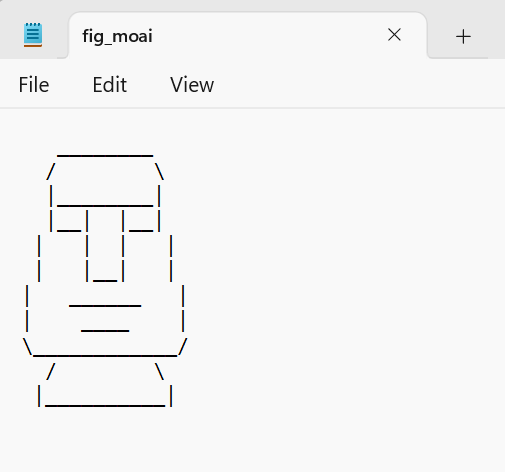
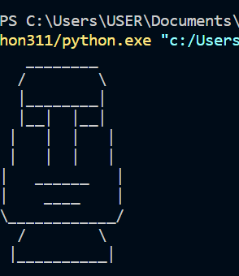

# Assignment 03

Group members
- Ansellma Tita Pakartiwuri Putri (10231017) (Problem 1)
- Ansellma Tita Pakartiwuri Putri (10231017) (Problem 2)
- Revalina Putria Hidayat (16231049) (Problem 3)
- Damasus Hardiven Waruwu (16231014) (Problem 4)
- Riska Fadlun Khairiyah P (StudentID) (Problem 5)
- Muhammad Kevin Wardhana (11231057) (Problem 6)

## Problem 1: Moai ASCII art 1 

Diberikan contoh ilustrasi patung MOAI dengan menggunakan karakter ASCII   
sebagai berikut

```
   ________
  /        \
  |________|
  |__|  |__|
 |   |  |   |
 |   |__|   |
|   ______   |
|    ____    |
\____________/
  /        \
 |__________|
 
```
Tuliskan spesifikasi untuk gambar ASCII art tersebut. Spesifikasi tersebut 
memuat:
- Karakter ASCII yang digunakan
- Ukuran kepala (tinggi dan lebar)
- Ukuran mata (tinggi dan lebar)
- Ukuran leher (tinggi dan lebar)


### Answer
```py
def draw_moai(vert_chars="/|\\", hor_char="_", 
              head_size=(1, 1), eye_size=(1, 1), neck_size=(1, 1)):
    # Define dimensions
    head_width = 8 * head_size[0]
    head_height = 1 * head_size[1]
    neck_width = 8 * neck_size[0]
    neck_height = 1 * neck_size[1]
    eyes_width = 2 * eye_size[0]
    eyes_height = 1 * eye_size[1]

    # Print the top part of the head
    print(" " * 3 + hor_char * head_width + " ")

    # Print the sides of the head
    for i in range(head_height):
        print(" " * 2 + vert_chars[0] + " " * head_width + vert_chars[2])

    # Print the bottom of the head
    print(" " * 2 + vert_chars[1] + hor_char * head_width + vert_chars[1])

    # Print the eyes
    print(" " * 2 + vert_chars[1] + hor_char * eyes_width + vert_chars[1] + " " * 2 + vert_chars[1] + hor_char * eyes_width + vert_chars[1])
    print(" " * 1 + vert_chars[1] + " " * (1 + eyes_width) + vert_chars[1] + " " * 2 + vert_chars[1] + " " * (1 + eyes_width) + vert_chars[1])
    print(" " * 1 + vert_chars[1] + " " * (1 + eyes_width) + vert_chars[1] + hor_char * eyes_width + vert_chars[1] + " " * 3 + vert_chars[1])

    # Print the neck
    print(vert_chars[1] + " " * 3 + hor_char * (6 * neck_size[0]) + " " * 3 + vert_chars[1])
    print(vert_chars[1] + " " * 4 + hor_char * (4 * neck_size[0]) + " " * 4 + vert_chars[1])

    # Print the bottom of the head (upside down)
    print(vert_chars[2] + hor_char * (12 * head_size[0]) + vert_chars[0])

    # Print the body and legs
    print(" " * 2 + vert_chars[0] + " " * neck_width + vert_chars[2])
    print(" " * neck_height + vert_chars[1] + hor_char * (10 * neck_size[0]) + vert_chars[1] * neck_height)


# Test the function without any input (default values will be used)
draw_moai()
```

## Problem 2: Moai ASCII art 2
Buatlah fungsi untuk mencetak ilustrasi MOAI dengan masukan fungsi
seperti yang telah dispesifikasikan di Problem 1. Gunakan _keyword arguments_
untuk kasus eksekusi fungsi tanpa masukan (tanpa input) dan memberikan
gambar seperti di Problem 1.

Contoh input argument:
```py
# nilai di input arguments bukan nilai sebenarnya. kalian harus menjawab 
# problem 1 dengan benar untuk tahu nilai-nilai tersebut.
def draw_moai(vert_chars="/|\\", hor_char="_", 
              head_size=(1, 1), eye_size=(1, 1), neck_size=(1, 1)):
  ## deskripsi fungsi
```


### Answer
```py
def draw_moai(vert_chars, hor_char, head_size, eye_size, neck_size):
    # Define dimensions based on input
    head_width = head_size[1]
    head_height = head_size[0]
    neck_width = neck_size[1]
    neck_height = neck_size[0]
    eyes_width = eye_size[1]
    eyes_height = eye_size[0]

    # Print the top part of the head
    print(" " * 3 + hor_char * head_width + " ")

    # Print the sides of the head
    print(" " * 2 + vert_chars[0] + " " * head_width + vert_chars[2])
    print(" " * 2 + vert_chars[1] + hor_char * head_width + vert_chars[1])

    # Print the eyes
    print(" " * 2 + vert_chars[1] + hor_char * eyes_width + vert_chars[1] + " " * eyes_width + vert_chars[1] + hor_char * eyes_width + vert_chars[1])
    print(" " * 1 + vert_chars[1] + " " * (1 + eyes_width) + vert_chars[1] + " " * eyes_width + vert_chars[1] + " " * (1 + eyes_width) + vert_chars[1])
    print(" " * 1 + vert_chars[1] + " " * (1 + eyes_width) + vert_chars[1] + hor_char * eyes_width + vert_chars[1] + " " * (1 + eyes_width) + vert_chars[1])

    # Print the neck
    print(vert_chars[1] + " " * 3 + hor_char * (neck_size[1] - 2) + " " * 3 + vert_chars[1])
    print(vert_chars[1] + " " * 4 + hor_char * (neck_size[1] - 4) + " " * 4 + vert_chars[1])

    # Print the bottom of the head (upside down)
    print(vert_chars[2] + hor_char * (head_size[1] + 4) + vert_chars[0])

    # Print the body and legs
    print(" " * 2 + vert_chars[0] + " " * neck_width + vert_chars[2])
    print(" " * neck_height + vert_chars[1] + hor_char * (neck_size[1] + 2) + vert_chars[1])


# Get user input
vert_chars = input("Masukkan karakter ASCII untuk vertikal (format: /|\\): ")
hor_char = input("Masukkan karakter ASCII untuk horizontal (contoh: _): ")
head_size = tuple(map(int, input("Masukkan ukuran kepala (tinggi lebar): ").split()))
eye_size = tuple(map(int, input("Masukkan ukuran mata (tinggi lebar): ").split()))
neck_size = tuple(map(int, input("Masukkan ukuran leher (tinggi lebar): ").split()))

draw_moai(vert_chars, hor_char, head_size, eye_size, neck_size)
```
Note: saat result problem 2 di*run* spesifikasi yang digunakan adalah:
- head: 1 8
- eyes: 1 2
- neck: 1 8

## Problem 3: Moai ASCII art 3
Simpan atau tulis keluaran dari fungsi di Problem 2 ke dalam file.
`fig:_moai.txt`.

### Answer
```py
def draw_moai(vert_chars, hor_char, head_size, eye_size, neck_size):
    # Define dimensions based on input
    head_width = head_size[1]
    head_height = head_size[0]
    neck_width = neck_size[1]
    neck_height = neck_size[0]
    eyes_width = eye_size[1]
    eyes_height = eye_size[0]

    # Print the top part of the head
    print(" " * 3 + hor_char * head_width + " ")

    # Print the sides of the head
    print(" " * 2 + vert_chars[0] + " " * head_width + vert_chars[2])
    print(" " * 2 + vert_chars[1] + hor_char * head_width + vert_chars[1])

    # Print the eyes
    print(" " * 2 + vert_chars[1] + hor_char * eyes_width + vert_chars[1] + " " * eyes_width + vert_chars[1] + hor_char * eyes_width + vert_chars[1])
    print(" " * 1 + vert_chars[1] + " " * (1 + eyes_width) + vert_chars[1] + " " * eyes_width + vert_chars[1] + " " * (1 + eyes_width) + vert_chars[1])
    print(" " * 1 + vert_chars[1] + " " * (1 + eyes_width) + vert_chars[1] + hor_char * eyes_width + vert_chars[1] + " " * (1 + eyes_width) + vert_chars[1])

    # Print the neck
    print(vert_chars[1] + " " * 3 + hor_char * (neck_size[1] - 2) + " " * 3 + vert_chars[1])
    print(vert_chars[1] + " " * 4 + hor_char * (neck_size[1] - 4) + " " * 4 + vert_chars[1])

    # Print the bottom of the head (upside down)
    print(vert_chars[2] + hor_char * (head_size[1] + 4) + vert_chars[0])

    # Print the body and legs
    print(" " * 2 + vert_chars[0] + " " * neck_width + vert_chars[2])
    print(" " * neck_height + vert_chars[1] + hor_char * (neck_size[1] + 2) + vert_chars[1])

# Get user input
vert_chars = input("Masukkan karakter ASCII untuk vertikal (format: /|\\): ")
hor_char = input("Masukkan karakter ASCII untuk horizontal (contoh: _): ")
head_size = tuple(map(int, input("Masukkan ukuran kepala (tinggi lebar): ").split()))
eye_size = tuple(map(int, input("Masukkan ukuran mata (tinggi lebar): ").split()))
neck_size = tuple(map(int, input("Masukkan ukuran leher (tinggi lebar): ").split()))

# Call the function
draw_moai(vert_chars, hor_char, head_size, eye_size, neck_size)

# Create a list to store the ASCII art
ascii_art = []

# Add the ASCII art to the list
ascii_art.append(" " * 3 + hor_char * head_size[1] + " ")
ascii_art.append(" " * 2 + vert_chars[0] + " " * head_size[1] + vert_chars[2])
ascii_art.append(" " * 2 + vert_chars[1] + hor_char * head_size[1] + vert_chars[1])
ascii_art.append(" " * 2 + vert_chars[1] + hor_char * eye_size[1] + vert_chars[1] + " " * eye_size[1] + vert_chars[1] + hor_char * eye_size[1] + vert_chars[1])
ascii_art.append(" " * 1 + vert_chars[1] + " " * (1 + eye_size[1]) + vert_chars[1] + " " * eye_size[1] + vert_chars[1] + " " * (1 + eye_size[1]) + vert_chars[1])
ascii_art.append(" " * 1 + vert_chars[1] + " " * (1 + eye_size[1]) + vert_chars[1] + hor_char * eye_size[1] + vert_chars[1] + " " * (1 + eye_size[1]) + vert_chars[1])
ascii_art.append(vert_chars[1] + " " * 3 + hor_char * (neck_size[1] - 2) + " " * 3 + vert_chars[1])
ascii_art.append(vert_chars[1] + " " * 4 + hor_char * (neck_size[1] - 4) + " " * 4 + vert_chars[1])
ascii_art.append(vert_chars[2] + hor_char * (head_size[1] + 4) + vert_chars[0])
ascii_art.append(" " * 2 + vert_chars[0] + " " * neck_size[1] + vert_chars[2])
ascii_art.append(" " * neck_size[0] + vert_chars[1] + hor_char * (neck_size[1] + 2) + vert_chars[1])

# Write ASCII art to a file
with open('fig_moai.txt', 'w') as file:
    for line in ascii_art:
        file.write(line + '\n')

print("ASCII art saved to 'fig_moai.txt'")
```
[Click here to see the file (fig_moai.txt)](fig_moai.txt)

Output:


## Problem 4: Calculating the mean of datetime

Diberikan data `waktu.txt` berikut

```txt
student id, time taken
16131053, 38 mins 12 secs
16131044, 42 mins 5 secs
16131014, 14 mins 21 secs
20131005, 31 mins 52 secs
16131055, 23 mins 51 secs
10131055, 48 mins 27 secs
10131066, 49 mins
11131014, 21 mins 15 secs
16131044, 36 mins 45 secs
20131022, 47 mins 1 sec
10131033, 46 mins 57 secs
16131002, 48 mins 54 secs
16131002, 49 mins 54 secs
16131005, 33 mins 36 secs
11131077, 50 mins
11131066, 50 mins
11131022, 50 mins
```
Buatlah suatu fungsi untuk membaca data `time taken` dan memberikan 
keluaran berupa total waktu pengerjaan dan rata-rata waktu pengerjaan.

Petunjuk: bentuk fungsi dapat memiliki bentuk sebggai berikut:
```py
def calcualte_time(file_input_str):
  # isi program
  return total_waktu, rata_rata_waktu
```


### Answer

```py
def calculate_time(file):
    
    with open("waktu.txt","r") as file:
        lines = file.readlines()

    total_waktu = 0 
    jumlah_data = 0 
    
    for line in lines[1:]: 
        parts = line.split(', ') 
        if len(parts) == 2:
            time_str = parts[1] 
            time_parts = time_str.split()  
            if len(time_parts) == 4:
                mins = int(time_parts[0]) 
                secs = int(time_parts[2]) 
                total_waktu += mins * 60 + secs 
                jumlah_data += 1 

    if jumlah_data > 0:
        rata_rata_waktu = total_waktu / jumlah_data  
    else:
        rata_rata_waktu = 0

    return total_waktu, rata_rata_waktu

total_waktu, rata_rata_waktu = calculate_time(license)
print("Total Waktu Pengerjaan:", total_waktu, "detik")
print("Rata-rata Waktu Pengerjaan:", rata_rata_waktu, "detik")
```

## Problem 5: Read secret code 🤫 
Diberikan suatu berkas rahasia `secret.txt` yang berisi data berikut:

```txt
aaa________cccbaa/aaaaaaaa\ccbaa|________|ccbaa|__|aa|__|ccba|aaa|aa|aaa|cba|aaa|aa|aaa|cb|aaa______aaa|b|aaaa____aaaa|b\____________/baa/aaaaaaaa\ccba|__________|cb 
```

Ingat pesan rahasia diatas hanya terdiri dari satu baris.

Menggunakan aturan _decryption_ berikut:
- karakter memuat huruf `a` di ubah spasi `" "` sebanyak kemunculan karakter `a`
- karakter memuat huruf `b` berapapun kemunculannya di ubah menjadi satu karakter
  baris baru `\n`
- karakter memuat huruf `c` berapapun kemunculannya di ubah menjadi karakter kosong `""`

Tentukan pesan rahasia yang ada di dalam `secret.txt`

### Answer
```py
with open('secret.txt', 'r') as file:
    message = file.read()

# replaces all occurrences of the character 'a' with a space ' ' in the message.
a_count = message.count('a')
message = message.replace('a', ' ')

# t replaces all occurrences of the character 'b' with a newline character '\n' 
message = message.replace('b', '\n')

# It removes all occurrences of the character 'c' 
message = message.replace('c', '')

print(message)
```

Berikut adalah output secret.txt setelah di decode:


(Habis nugas saya mabuk patung moai pak)

## Problem 6: Read histogram data
Bacalah data dari file `inventory_table.txt` berikut

```txt
Tabel inventory:
 Emerald: **
 Diamond: ******************************
Redstone: ***********
   Brick: ****************************
    Coal: *****************
Snowball:
 Leather: **********
   Paper: *********
   Flint: ****
```

Lalu nyatakan data _inventory_ tersebut menggunakan tipe data
_dictionary_ dengan `key` nama item dan `value` adalah banyaknya
item untuk nama tersebut. 
Cetak hasil pembacaan data tersebut untuk mengecek apakah sudah
benar atau belum.

### Answer
```py
inventory_data = {}

with open("inventory_table.txt", "r") as file:
    lines = file.readlines()
    
    for line in lines:
        parts = line.strip().split(": ")
        if len(parts) == 2:
            item_name, item_count = parts[0], parts[1]
            inventory_data[item_name] = len(item_count)
        else:
            item_name = parts[0]
            inventory_data[item_name] = 0

for item, count in inventory_data.items():

    print(f"{item}: {count}")
```
